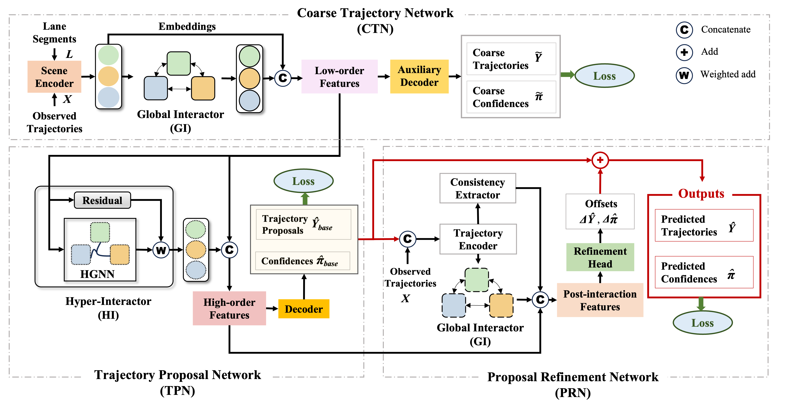

# Pioformer

Official implementation of **Post-interactive Multimodal Trajectory Prediction for Autonomous Driving**, published in *Transportation Research Part C: Emerging Technologies* (2025).

Pioformer consists of a Coarse Trajectory Network (CTN), a Trajectory Proposal Network (TPN), and a Proposal Refinement Network (PRN).



## Installation

The reference environment uses Python 3.8, PyTorch 1.13.0, CUDA 11.6, PyTorch Geometric 2.3.0, and PyTorch Lightning 1.5.2.

```bash
python -m pip install -r requirements.txt
git clone https://github.com/argoverse/argoverse-api.git
python -m pip install --no-deps -e ./argoverse-api
```

## Dataset

Download the Argoverse 1 Motion Forecasting Dataset and pass the dataset root containing `train/data/` and `val/data/` to `--root`.

## Training

The training script automatically runs CTN, TPN, and PRN in three consecutive stages.

Pioformer-S:

```bash
python train.py --root /path/to/argoverse1 --embed_dim 64
```

Pioformer-L:

```bash
python train.py --root /path/to/argoverse1 --embed_dim 128
```

Checkpoints and training logs are saved under `runs/<run-name>/`.

## Evaluation

```bash
python eval.py \
  --root /path/to/argoverse1 \
  --checkpoint runs/pioformer-s/stage-3/best.ckpt \
  --embed_dim 64
```

Evaluation reports minADE, minFDE, and MR for the Argoverse focal agent.

## Citation

```bibtex
@article{huang2025post,
  title={Post-interactive multimodal trajectory prediction for autonomous driving},
  author={Huang, Ziyi and Li, Yang and Li, Dushuai and Mu, Yao and Qin, Hongmao and Zheng, Nan},
  journal={Transportation Research Part C: Emerging Technologies},
  volume={179},
  pages={105271},
  year={2025},
  publisher={Elsevier}
}
```

## Acknowledgements

This implementation builds on [HiVT](https://github.com/ZikangZhou/HiVT) and refers to the hypergraph construction in [GroupNet](https://github.com/MediaBrain-SJTU/GroupNet).

## License

This project is released under the [Apache License 2.0](LICENSE).
